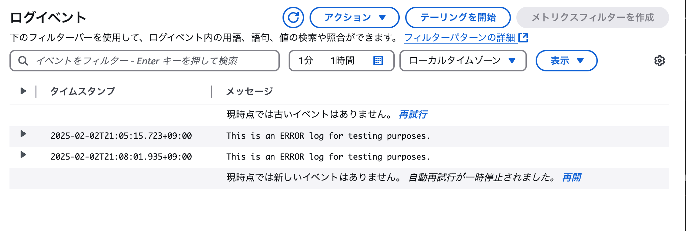

## このリポジトリは？

以下が実現できるかを確認するためのもの。

- CloudWatchLogs→CloudWatchAlarm→SNS→SQS
  - CloudWatchLogsに```ERROR```があった場合に、SQSに連携する
- CloudWatchAlarm（カスタムメトリクス）→SNS→SQS
  - CloudWatchAlarmのカスタムメトリックスでアラームがあった場合に、SQSに連携する

## 確認方法

SQSのリスト

```bash
aws sqs list-queues
```

以下のようにキューが表示される。

```
{
    "QueueUrls": [
        "https://sqs.ap-northeast-1.amazonaws.com/449671225256/example-queue"
    ]
}
```

SQSのメッセージの内容を確認する。


```bash
aws sqs receive-message --queue-url https://sqs.ap-northeast-1.amazonaws.com/449671225256/example-queue --max-number-of-messages 10 --visibility-timeout 30 --wait-time-seconds 0
```

- `--queue-url`: 対象のSQSキューのURL。
- `--max-number-of-messages`: 一度に受信するメッセージの最大数（最大10）。
- `--visibility-timeout`: 他のコンシューマが同じメッセージを受信できるまでの非表示時間（秒）。
- `--wait-time-seconds`: ロングポーリングの待機時間（秒）。0に設定すると即座にレスポンスを返す。


CloudWatchLogsからのメッセージは以下のように表示。

```
{
    "Messages": [
        {
            "MessageId": "97e4e804-1188-4528-9327-94f0af040538",
            "ReceiptHandle": "AQEBD7ieoJKbv2vol/svFxtw6PRD0xaUTdZQTa3m306kRhkQWvc7WMSs6oG+A1qL4sm9UeczOiHCznOs2dGOTcdy8fyDChbD6vJYVfUJANqNa26RZYfNyTv9REOLGgJEDYmPPVIjVpJCUY7xRQlVzzmta11MINM1GFTC7MVE5ShZ99JetfLhF7zk0ThdA62Cv0u4Tg/fLnQDT15YJDy7/FfwnjNltAFC5JfST1hcYhZgpbTvNZoaykt4xAvrFBxNlPTB0pNw/stm2oy5+RbvJIhXVPNDvAV6HnnSdBU4nX4zBdTFW57oCyPRaaAiUGcs87kvsOnifkakHCuCO/7at62+8hJr8OP2e9JpFsGkPGRueT1MF6XUJjfT7n44plUxUZfbBCPBxk9AbGSwcLXX1WUvoA==",
            "MD5OfBody": "15a83be8c887f861a4242c406e0d85a1",
            "Body": "{\"AlarmName\":\"ErrorAlarm\",\"AlarmDescription\":\"Alarm when ERROR appears in logs\",\"AWSAccountId\":\"449671225256\",\"AlarmConfigurationUpdatedTimestamp\":\"2025-02-02T11:48:52.788+0000\",\"NewStateValue\":\"ALARM\",\"NewStateReason\":\"Threshold Crossed: 1 datapoint [1.0 (02/02/25 12:05:00)] was greater than or equal to the threshold (1.0).\",\"StateChangeTime\":\"2025-02-02T12:06:35.472+0000\",\"Region\":\"Asia Pacific (Tokyo)\",\"AlarmArn\":\"arn:aws:cloudwatch:ap-northeast-1:449671225256:alarm:ErrorAlarm\",\"OldStateValue\":\"INSUFFICIENT_DATA\",\"OKActions\":[\"arn:aws:sns:ap-northeast-1:449671225256:example-topic\"],\"AlarmActions\":[\"arn:aws:sns:ap-northeast-1:449671225256:example-topic\"],\"InsufficientDataActions\":[],\"Trigger\":{\"MetricName\":\"ErrorCount\",\"Namespace\":\"YourNamespace\",\"StatisticType\":\"Statistic\",\"Statistic\":\"SUM\",\"Unit\":null,\"Dimensions\":[],\"Period\":60,\"EvaluationPeriods\":1,\"ComparisonOperator\":\"GreaterThanOrEqualToThreshold\",\"Threshold\":1.0,\"TreatMissingData\":\"missing\",\"EvaluateLowSampleCountPercentile\":\"\"}}"
        }
    ]
}
```
CloudWatchAlarm（カスタムメトリクス）からのメッセージは以下のように表示。


```
aws sqs receive-message --queue-url https://sqs.ap-northeast-1.amazonaws.com/449671225256/example-queue --max-number-of-messages 10 --visibility-timeout 30 --wait-time-seconds 0
{
    "Messages": [
        {
            "MessageId": "8a6424b7-c4c6-47d2-b908-62e75c931ef9",
            "ReceiptHandle": "AQEBWkkf7keb304rOMxpa+RsruQR1M5PuPAiY/W28VWDsjz0j4Z/iLT2cf2teMvnpAQEQVHPSdp+2611Ez0Da1xDV6qZn36RLl8DQGTFF+7A+Ow75MOTG9LiwXG+j33BxMbXKv8METh8nIvDDucZBVBcCtcBgZbPbGMEX7hP86K54/IkwLLo6CAPwfhrc8u/sYcoBn9Ym6oGsBD+qv74jvXnWIqS91k56YNlV5KcGH9EKPHwmHZEoheEMamT/16V1BKAbxCXa/ctg4I49w825z9kKDFCWKmt6l2JMlgR5b/aF/jrGwWY6ZA17Bah7SocIFhu6XvMVoD7lB8LhhVAFRZCISx6AB5h7h1RzAJl/1k8k4IXZkcMcav2LRTHdQXnerGeU3IwsVT2OeU5uNU5Gk7CSQ==",
            "MD5OfBody": "bd04786c61f68395416b17d100ab1801",
            "Body": "{\"AlarmName\":\"CustomMetricAlarm\",\"AlarmDescription\":\"カスタムメトリックがしきい値を超えた場合にSNS経由でSQSに通知。\",\"AWSAccountId\":\"449671225256\",\"AlarmConfigurationUpdatedTimestamp\":\"2025-02-02T13:18:55.051+0000\",\"NewStateValue\":\"ALARM\",\"NewStateReason\":\"test\",\"StateChangeTime\":\"2025-02-02T13:25:02.875+0000\",\"Region\":\"Asia Pacific (Tokyo)\",\"AlarmArn\":\"arn:aws:cloudwatch:ap-northeast-1:449671225256:alarm:CustomMetricAlarm\",\"OldStateValue\":\"INSUFFICIENT_DATA\",\"OKActions\":[\"arn:aws:sns:ap-northeast-1:449671225256:example-topic\"],\"AlarmActions\":[\"arn:aws:sns:ap-northeast-1:449671225256:example-topic\"],\"InsufficientDataActions\":[],\"Trigger\":{\"MetricName\":\"pocCustomMetric\",\"Namespace\":\"pocCustomNamespace\",\"StatisticType\":\"Statistic\",\"Statistic\":\"SUM\",\"Unit\":null,\"Dimensions\":[],\"Period\":60,\"EvaluationPeriods\":1,\"ComparisonOperator\":\"GreaterThanThreshold\",\"Threshold\":100.0,\"TreatMissingData\":\"missing\",\"EvaluateLowSampleCountPercentile\":\"\"}}"
        }
    ]
}
```


## TIPS

ログストリームの存在確認

```bash
aws logs describe-log-streams --log-group-name "/aws/poc-sqs/log-group" --log-stream-name-prefix "test-stream"
```

ログストリームを作る（ログストリームが存在しない場合）

```bash
aws logs create-log-stream --log-group-name "/aws/poc-sqs/log-group" --log-stream-name "test-stream"
```

シーケンストークンの確認

```bash
aws logs describe-log-streams \
    --log-group-name "/aws/poc-sqs/log-group" \
    --log-stream-name-prefix "test-stream" \
    --query "logStreams[0].uploadSequenceToken" \
    --output text
```

シーケンストークンを入れてログを書き込む

```bash
aws logs put-log-events \
    --log-group-name "/aws/poc-sqs/log-group" \
    --log-stream-name "test-stream" \
    --log-events timestamp=$(date +%s%3N),message="This is an ERROR log for testing purposes." \
    --sequence-token <SEQUENCE_TOKEN>
```

マネコンで確認。

